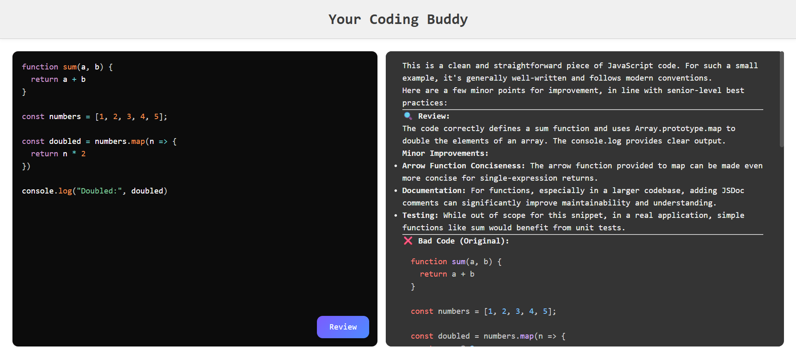

# 🧠 AI Code Reviewer

An intelligent code review tool powered by Google Gemini (via the Generative AI API). This full-stack application allows developers to paste code and receive detailed reviews based on modern best practices, clean coding principles, and performance/security guidelines.

> 📌 Live Demo: [Visit Frontend](https://code-reviewer-frontend-cyan.vercel.app/)
> 🌐 Backend API: [Render Backend](https://codereviewer-backend-0hrj.onrender.com)

---

## ⚙️ Tech Stack

### 🔹 Frontend
- React (Vite)
- React Simple Code Editor
- PrismJS (Syntax Highlighting)
- Markdown Rendering (`react-markdown`)
- Highlight.js
- Axios

### 🔹 Backend
- Node.js
- Express.js
- Google Generative AI SDK (`@google/generative-ai`)
- CORS
- Dotenv

### 🔹 AI Model
- Google Gemini (`gemini-2.5-flash`)

---

## 📸 Screenshots



---

## 🚀 Features

- ✅ Paste your code and get AI-generated review suggestions
- ✅ Highlights errors, inefficiencies, and anti-patterns
- ✅ Suggests clean, readable, and scalable alternatives
- ✅ Provides before/after comparisons with detailed explanations
- ✅ Mobile-responsive & developer-friendly UI

---

## 🏗️ Project Structure

```
CodeReviewer/
├── backend/
│   ├── server.js
│   ├── .env
│   ├── src/
│   │   ├── app.js
│   │   ├── controllers/ai.controller.js
│   │   ├── routes/ai.routes.js
│   │   └── services/ai.service.js
├── frontend/
│   ├── src/
│   │   ├── App.jsx
│   │   ├── App.css
│   │   └── ...
│   ├── public/
│   └── package.json
```

---

## 🧪 Local Development

### ✅ Clone the repo

```bash
git clone https://github.com/Soumyad2003/CodeReviewer.git
cd CodeReviewer
```

### ✅ Setup Backend

```bash
cd backend
npm install
```

Create a `.env` file inside `backend/`:

```env
GOOGLE_GEMINI_KEY=your_actual_api_key
```

Run the server:

```bash
npm start
```

Your backend should now run on `http://localhost:3000`.

---

### ✅ Setup Frontend

```bash
cd ../frontend
npm install
npm run dev
```

The React app will be available at `http://localhost:5173`.

---

## ☁️ Deployment

### 🔸 Backend (Render)
- Hosted on [Render](https://render.com)
- URL: `https://codereviewer-backend-0hrj.onrender.com`

### 🔸 Frontend (Vercel)
- Hosted on [Vercel](https://vercel.com)
- Update the backend endpoint in `App.jsx`:

```js
const response = await axios.post('https://codereviewer-backend-0hrj.onrender.com/ai/get-review', { code });
```

---

## 🙌 Acknowledgements

- [Google Generative AI SDK](https://github.com/google/generative-ai-js)
- [PrismJS](https://prismjs.com/)
- [React Markdown](https://github.com/remarkjs/react-markdown)
- [Render](https://render.com)
- [Vercel](https://vercel.com)

---

## 📄 License

MIT License. Feel free to fork, enhance, and share!

---

## 🔗 Connect

- GitHub: [@Soumyad2003](https://github.com/Soumyad2003)
- LinkedIn: (https://www.linkedin.com/in/soumyadeepseal21/)